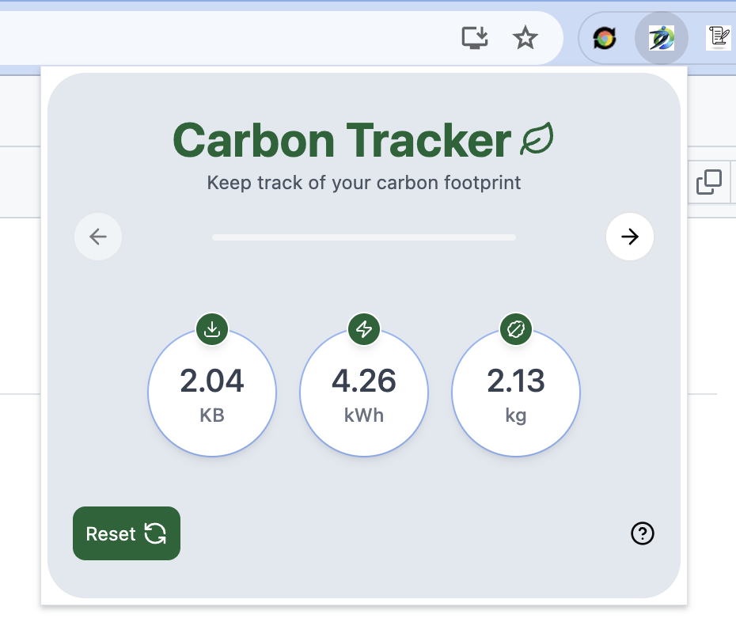
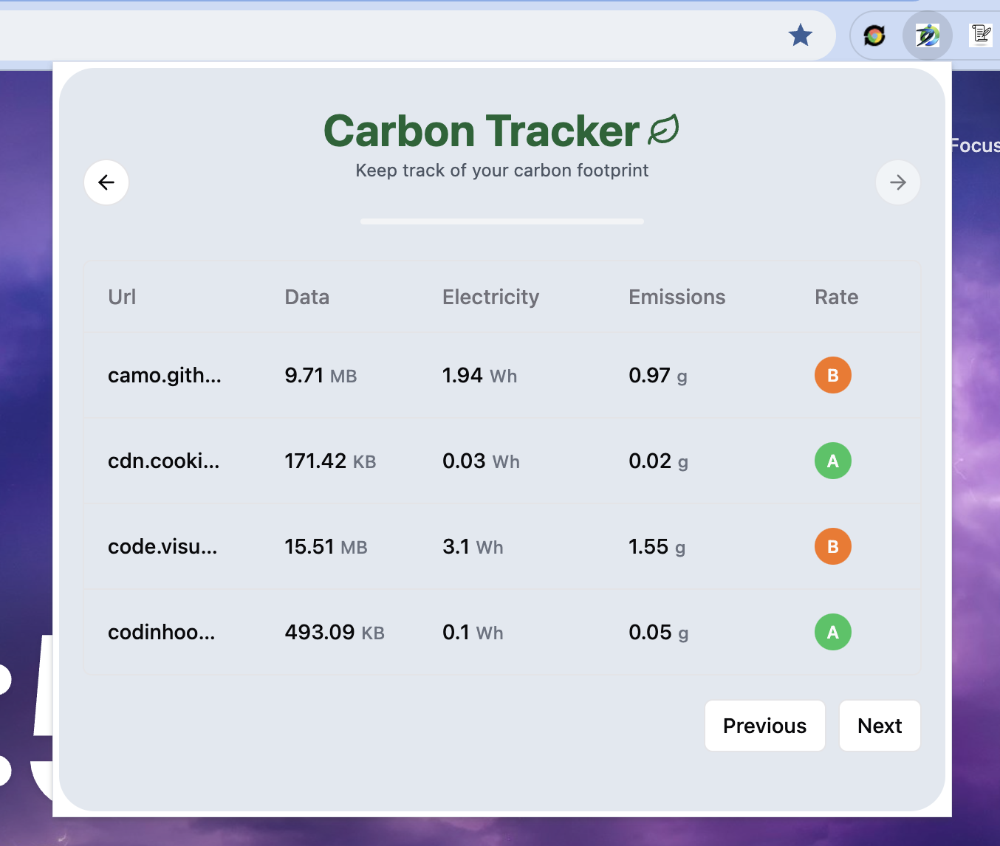

# Carbon Tracker 🍃

`Carbon Tracker` is a Chrome extension that allows users to track their data consumption, electricity usage, and carbon footprint.

---

<div style="display:flex; justify-content:center; gap:20px;">
   
   
</div>

## 🤔 Why use Carbon Tracker

`Carbon Tracker` helps users monitor their environmental impact by tracking their internet usage and its associated carbon footprint. By understanding their data consumption and energy usage, users can make more informed decisions to reduce their carbon emissions.

## 🚀 Quick Start

### 🛠 Install dependencies

### 1.Use PNPM ( Recommend )

```bash
pnpm install
```

### 2.Build

```bash
pnpm run build
```

### 3.Watch with Nodemon

```(bash)
npx nodemon
```

### 4.Upload the `dist` directory in the `chrome extension manager`

## ☔️ Dependencies

- [react (vite)](https://vitejs.dev/guide/)
- [Manifest 3](https://developer.chrome.com/docs/extensions/develop/migrate?hl=fr) from Chrome API.
- [CRXJS](https://crxjs.dev/vite-plugin)

### ⚙️ Edit the `vite.config.ts` to change the dist structure or add entries and outputs to the extension

```ts
import { crx } from "@crxjs/vite-plugin";
import react from "@vitejs/plugin-react";
import { defineConfig } from "vite";
import tsconfigPaths from "vite-tsconfig-paths";
import manifest from "./manifest.json";

export default defineConfig({
  plugins: [react(), crx({ manifest }), tsconfigPaths()],
  resolve: {
    alias: {
      "@": new URL("/", import.meta.url).pathname,
    },
  },
  build: {
    // background.ts to background.js
    rollupOptions: {
      input: {
        background: "src/background/background.ts",
      },
      output: {
        entryFileNames: "[name].js",
      },
    },
  },
});
```

### 🙃 Start playing

- Write your view in `popup.tsx`
- Build your logic using the [chrome API](https://developer.chrome.com/docs/extensions/reference/api?hl=fr) in `background.ts`
